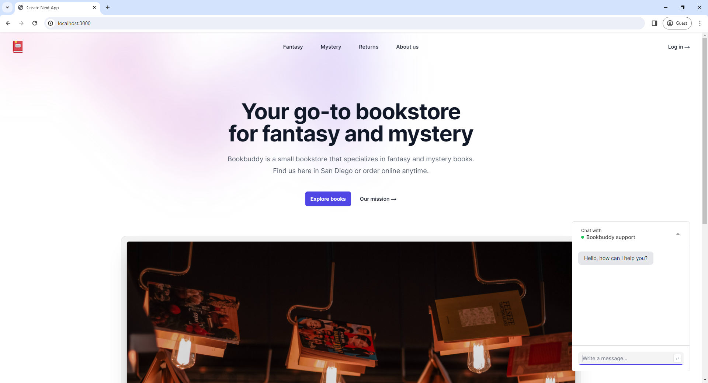
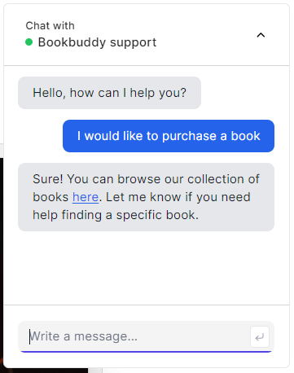

# Book Buddy

Book Buddy is a customer support chatbot powered by OpenAI's GPT-3.5. It provides real-time, streamed responses to user inquiries, ensuring a smooth and efficient customer support experience. This project is built using Next.js.

## Features

- Real-time streamed chatbot responses
- Rate-limited API routes
- Developed using TypeScript

## Screenshots

### Home Page



### Chat Bot Conversation



## Demo Video

Check out the demo video showcasing the main features of Book Buddy: [Demo Video](demo/demo.mp4)

## Getting Started

To get a local copy up and running, follow these steps.

### Prerequisites

- Node.js
- TypeScript

### Installation

1. Clone the repository:

   ```bash
   git clone https://github.com/stefan-smol/bookbuddy.git
   cd book-buddy
   ```

2. Install dependencies:

   ```bash
   npm install
   ```

3. Create a `.env` file in the root directory and add your OpenAI API key and other environment variables:

   ```
   OPENAI_API_KEY=your_openai_api_key
   REDIS_URL=your_redis_url
   REDIS_SECRET=your_redis_secret
   ```

4. Start the development server:

   ```bash
   npm start
   ```
